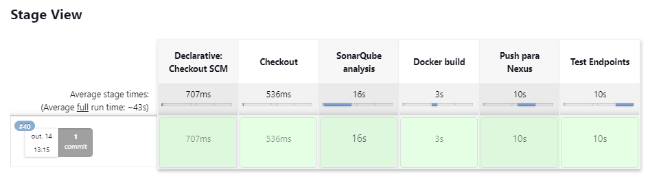

# API de Geração de QR Code

Esta API permite que os usuários se registrem e gerem QR Codes com base nos dados fornecidos.

## Funcionalidades

- Registro de usuários.
- Geração de QR Codes.
- Autenticação via API Key.
- Documentação da API com Swagger.

## Instalação e Configuração

1. **Pré-requisitos**:
   - Python 3
   - Virtualenv (opcional)

2. **Configuração**:

   - Clone o repositório ou faça o download do código-fonte.
   - Recomenda-se criar um ambiente virtual:
     ```
     virtualenv venv
     source venv/bin/activate   # No Windows use: venv\Scripts\activate
     ```
   - Instale as dependências:
     ```
     pip install Flask Flask-SQLAlchemy qrcode[pil] flask-swagger-ui
     ```

3. **Inicialização do Banco de Dados**:

   - Execute o seguinte para criar as tabelas necessárias:
     ```python
     from app import db
     db.create_all()
     ```

4. **Executando o App**:

   - Inicie o servidor com:
     ```
     python app.py
     ```

## Uso

1. **Registro**:
   - Acesse `http://127.0.0.1:5000/dashboard` para se registrar.
   - Após o registro, uma API Key será gerada. Guarde-a, pois ela será usada para autenticar as requisições.

2. **Geração de QR Codes**:
   - Faça uma requisição POST para `http://127.0.0.1:5000/generate_qrcode` com o conteúdo desejado no corpo da requisição e a API Key no header `x-api-key`.

3. **Documentação da API**:
   - Acesse `http://127.0.0.1:5000/api/docs` para visualizar a documentação da API com Swagger.

## Detalhes Técnicos

- **Backend**: Desenvolvido em Flask.
- **Banco de Dados**: SQLite para simplicidade, mas pode ser facilmente adaptado para outros bancos de dados.
- **Autenticação**: Via API Key.
- **Documentação da API**: Swagger.


---

## Execução Jenkins

<div align="center">
    
</div>

- **Checkout**: Obtém o código-fonte do repositório.</br>
- **SonarQube analysis**: Analisa o código em busca de problemas usando o SonarQube.</br>
- **Docker build**: Remove contêineres/imagem antigos (se existirem), constrói uma nova imagem Docker e executa um contêiner com essa imagem.</br>
- **Push para Nexus**: Faz login no Nexus e envia a imagem Docker para ele. </br>
- **Test Endpoints**: Espera um pouco e, em seguida, executa um script para testar os endpoints do serviço.</br>



---

## Nexus Repository
<div align="center">
    
</div>


- **Centralização**: Armazenar e gerenciar imagens Docker de forma centralizada, garantindo a consistência e fácil acesso.
- **Segurança**: Controlar o acesso às imagens, permitindo apenas usuários autorizados a enviar ou retirar imagens.
- **Cache**: Acelerar builds e deployments, armazenando localmente as imagens usadas frequentemente, reduzindo a necessidade de buscar imagens de fontes externas.
- **Integração com CI/CD**: Facilitar a integração contínua e entrega contínua, permitindo o armazenamento e recuperação automatizada de imagens Docker dentro do pipeline


---

## Sonarqube

<div align="center">
    
</div>

O SonarQube é uma plataforma de código aberto que analisa e avalia a qualidade do código-fonte, identificando bugs, vulnerabilidades e padrões inadequados para melhorar a manutenibilidade e a segurança do software.

- **Análise**: O SonarQube verifica o código durante o estágio "SonarQube analysis".
- **Configuração**: O comando sonar-scanner define os detalhes do projeto e se conecta ao servidor SonarQube.
- **Resultados**: Após a análise, os resultados são enviados para o servidor SonarQube, onde você pode visualizar os problemas e métricas.


---

## Docker

<div align="center">
    
</div>

Docker é uma plataforma que permite criar, distribuir e executar aplicações em contêineres. Utilizar o Docker oferece várias vantagens:

- **Isolamento**: Cada contêiner Docker funciona de forma isolada, garantindo que as dependências e configurações de uma aplicação não afetem outras.

- **Portabilidade**: Uma vez que a aplicação está em um contêiner Docker, ela pode ser executada consistentemente em qualquer ambiente que suporte o Docker, seja em desenvolvimento, teste ou produção.

- **Eficiência**: Contêineres compartilham o mesmo sistema operacional host, tornando-os mais leves do que as máquinas virtuais tradicionais. Isso permite executar mais contêineres no mesmo hardware.

- **Desenvolvimento Consistente**: Desenvolvedores podem construir e testar contêineres em suas máquinas locais, garantindo que o ambiente seja o mesmo em todos os estágios do ciclo de vida da aplicação.

- **Integração e Entrega Contínua**: O Docker se integra bem com ferramentas de CI/CD, permitindo automatizar o processo de construção, teste e distribuição de contêineres.

- **Escalabilidade**: O Docker pode ser integrado a plataformas de orquestração, como Kubernetes, para gerenciar, escalar e manter contêineres em clusters.

- **Microserviços**: Docker é ideal para arquiteturas de microserviços, pois cada serviço pode ser colocado em seu próprio contêiner, permitindo escalabilidade, isolamento e gerenciamento independentes.

- **Versionamento e Reutilização**: Imagens Docker podem ser versionadas e reutilizadas, facilitando rollbacks e a reutilização de configurações e dependências.


<br><br><br><br>
<div align="center">
    
</div>


